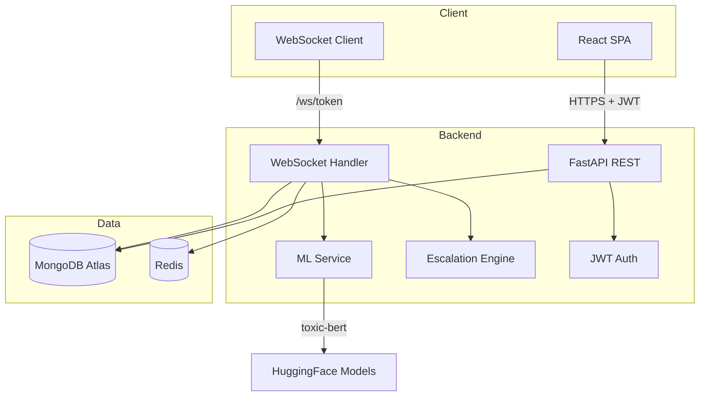

# ToxiChat Pro RC-1 — AI-Powered Toxicity Prediction Platform

Production-ready real-time chat with ML toxicity detection, conversation escalation prediction, JWT authentication, admin moderation, image moderation, and comprehensive analytics.


## Project Overview

ToxiChat Pro RC-1 is a highly scalable, real-time messaging platform focused on trust, safety, and community moderation. It leverages a modern React SPA on the frontend and an asynchronous FastAPI + WebSocket architecture on the backend, tightly integrated with a sophisticated AI inference pipeline for real-time text analysis.

## Features

- **JWT Authentication** — Register, login, forgot/reset password, and protected routes.
- **Real-time WebSocket Chat** — Typing indicators, online status, delivered/seen ticks, auto-reconnect with exponential backoff.
- **AI Toxicity Detection** — HuggingFace Transformers → scikit-learn → keyword fallback.
- **Pre-send Warning Popup** — Review toxic messages before sending with rewrite suggestions.
- **Conversation Escalation Prediction** — Health scores and trend analysis per chat.
- **User Reputation Scores** — Dynamic scoring based on message history.
- **Analytics Dashboard** — Toxicity trends, conversation health, flagged content.
- **Admin Moderation Panel** — Flagged messages, user management, mute/unmute, audit trail, and compliance.
- **Image Moderation (Admin)** — OCR and NSFW image analysis for incident evidence.
- **Moderator Copilot** — NLP query agent for querying chat history and platform metrics.
- **Dark / Light Mode** — Theme toggle with persistent preference.

## Tech Stack

- **Frontend**: React 18, React Router DOM, Framer Motion, TailwindCSS, Vite.
- **Backend**: Python 3.13, FastAPI, WebSockets, Uvicorn, PyJWT, Passlib (Bcrypt).
- **Database**: MongoDB (Motor async driver), Redis (Rate limiting).
- **AI/ML Engine**: EasyOCR, NudeNet, HuggingFace (Detoxify / BERT).

## Architecture



## Folder Structure

```
toxichat/
├── backend/
│   ├── main.py              # FastAPI app (REST + WebSocket)
│   ├── auth_router.py       # Authentication routes
│   ├── database.py          # MongoDB configuration
│   ├── ai/                  # AI Pipeline (Image, Audio, NLP)
│   ├── models.py            # Pydantic schemas
│   ├── security.py          # Password hashing, sanitization
│   └── requirements.txt
├── frontend/
│   ├── src/
│   │   ├── components/      # React UI components (Auth, Chat, Admin)
│   │   ├── context/         # Auth + Theme providers
│   │   └── services/        # API client layer (REST endpoints)
├── docker-compose.yml
└── render.yaml              # Render deployment configuration
```

## AI Features

- **Toxicity Detection**: Analyzes text payloads instantly using a resilient pipeline wrapper.
- **Rewrite engine**: Suggests positive, de-escalating alternatives for flagged messages.
- **Health Score**: Tracks the emotional trajectory of an ongoing chat (0-100 score).

## Authentication

- Fully robust JWT authentication strategy via PyJWT.
- Tokens securely persisted in localStorage, decoded for Context provision.
- Backend routes strictly gated via `Depends(get_current_user)` and `Depends(require_admin)`.

## Chat Features

- Lightning fast WebSockets with a one-to-one dictionary mapping.
- Auto-reconnect with exponential backoff algorithm (resumes typing, presence, and unread ticks without refreshing).

## Image Moderation

- Robust `/api/image/analyze` backend endpoint capable of OCR extraction (EasyOCR) and NSFW classification.
- Integrated fully into the **Admin Dashboard** via the `ImageEvidenceViewer` for resolving complex user incidents. *(Note: General chat attachments are deferred to RC-2).*

## Admin Dashboard

- **Incident Management**: Assign, resolve, and archive moderation tickets.
- **Audit Trail**: Chronological immutable tracking of all admin actions.
- **Compliance Reports**: Downloadable JSON/CSV GDPR-friendly data exports.
- **Telemetry**: Real-time visualization of model inference latency and accuracy.

## Installation & Local Setup

### Prerequisites

- Python 3.11+
- Node.js 18+
- MongoDB instance (local or Atlas)

### 1. Backend

```bash
cd backend
cp .env.example .env
pip install -r requirements.txt
python -m uvicorn main:app --host 0.0.0.0 --port 8000 --reload
```

API runs at `http://localhost:8000`

### 2. Frontend

```bash
cd frontend
npm install
npm run dev
```

App runs at `http://localhost:3000`

## Environment Variables

| Variable | Description | Default |
|----------|-------------|---------|
| `SECRET_KEY` | JWT signing key | (change in prod!) |
| `MONGO_URL` | MongoDB connection string | `mongodb://localhost:27017` |
| `DB_NAME` | Database name | `toxichat` |
| `REDIS_URL` | Redis connection | `redis://localhost:6379` |
| `CORS_ORIGINS` | Allowed origins (comma-separated) | `*` |
| `REACT_APP_API_URL` | Frontend API base URL | `http://localhost:8000` |

## API Overview

- **Auth**: `/api/register`, `/api/login`, `/api/me`
- **Chat**: `/api/users`, `/api/messages/{u1}/{u2}`, `/api/search`
- **AI**: `/api/predict`, `/api/rewrite`, `/api/image/analyze`
- **Admin**: `/api/incidents`, `/api/audit`, `/api/admin/copilot`
- **WebSockets**: `ws://{host}/ws/{jwt_token}`

## Screenshots

> *Placeholder: Add screenshots of Login, Chat, Pre-send Warning, Analytics Dashboard, and Admin Panel after deployment.*

## Deployment Instructions

### Full Stack Docker
```bash
docker-compose up --build
```

### Production Best Practices
- Ensure `SECRET_KEY` is cryptographically strong.
- Run MongoDB behind a VPC or configure strict IP whitelisting.
- Set `REACT_APP_API_URL` to point to the production backend URI during Vite build.
- Use Nginx or an Application Load Balancer to terminate SSL/TLS.

## Future Roadmap (RC-2)

- **Proper Cloud Storage Integration**: Add an S3/GCS bucket for file attachments.
- **Chat Image Attachments**: Enable standard users to upload images in the chat UI.
- **Voice Messages**: Integrate the existing `/api/audio/analyze` (Whisper) endpoint into the frontend.
- **Group Chats**: Activate the backend `GroupCreate` schemas to allow N-user group messages.
- **Offline Message Queue**: Cache outbound messages in IndexedDB if the WebSocket drops, automatically flushing them upon reconnect.
- **Performance Optimizations**: Move AI inference off the main WebSocket thread and onto a Celery/Redis background task queue to maximize concurrency.

## License

MIT
